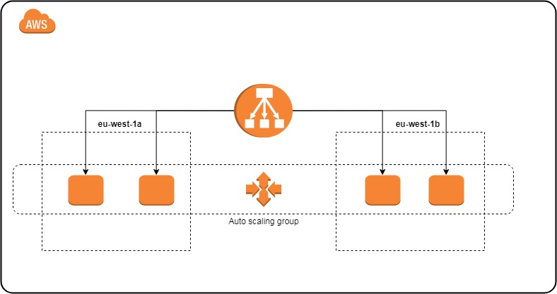
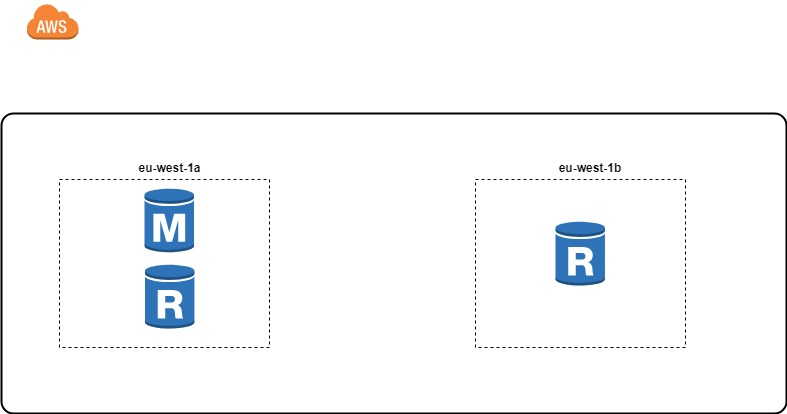
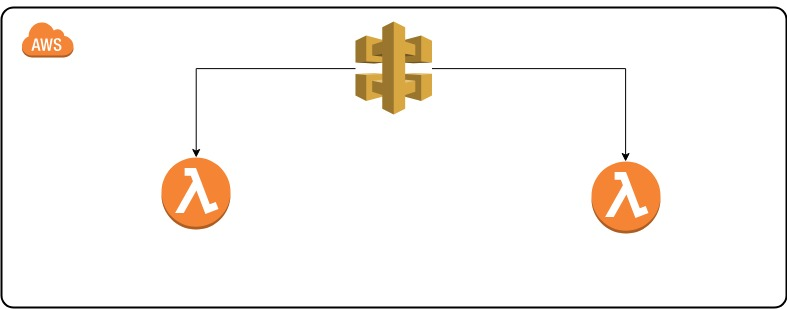
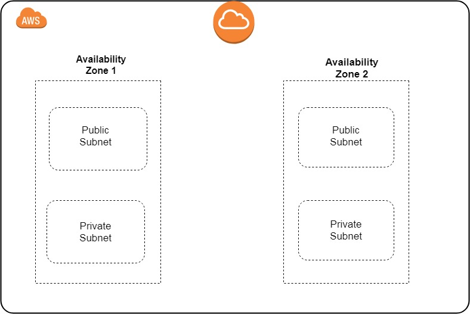
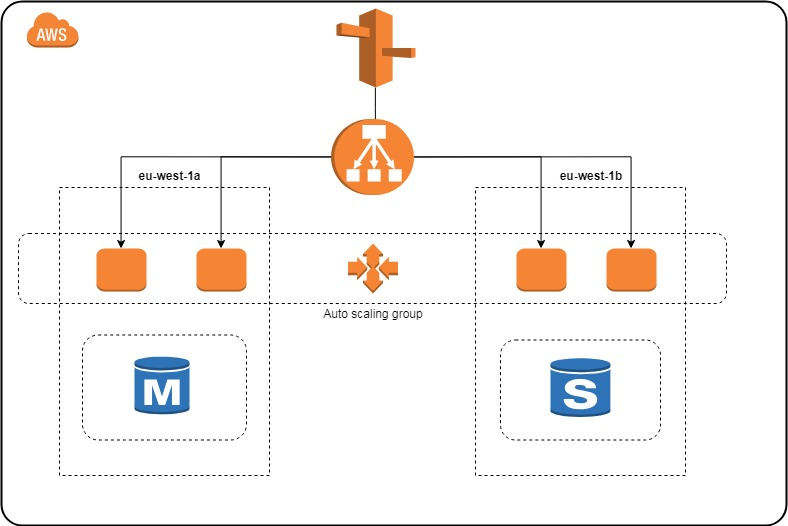

# Terraform snippets
These [Terraform](https://terraform.io) snippets can be used to deploy ressources and test them using [AWSPEC](https://github.com/k1LoW/awspec).

the project contains two main folders for terraform , one for non production environment and one for prod .
The preferred method is to keep seperate state files for each environment , so we deploy the stack in non prod environment , and run the tests to check that terraform behaves as expected , if everything is ok we can switch to prod.


## Getting started

### Prerequisites
[Install Terraform](https://www.terraform.io/intro/getting-started/install.html).

Install AWSPEC with gem.
```
gem install awspec
```
Install rake.
```
gem install rake
```
### Get AWS Credentials
Use the platform auth cli to get your AWS credentials .

Configure environment variables with the appropriate AWS profile and region. Example :
```
AWS_PROFILE=role-test
AWS_REGION=eu-west-1
```
### Deploying the stack

#### Configure variables
Modify the variables.tf file with the appropriate values for the modules variables .

Each module will deployed the following resources:
##### Module Application


##### Module Database


##### Module Serverless


##### Module VPC

##### Example
You can combine modules to define an architecture that fits your needs . Example :


#### Initialize the porject
After configuring the stack and setting up the prerequisites, initialize terraform :
```
terraform init
```
Load the modules :
```
terraform get
```

Terraform plan to get an overview of what terraform will be deploying :
```
terraform plan
```
If everything is ok , Deploy the stack :
```
terraform apply
```

### Running tests

Once the ressources are provisionned , we need to make sure that terraform behaved as we expected and the created ressources are properly configured , run the tests by running in the non prod folder:
```
rake
```
